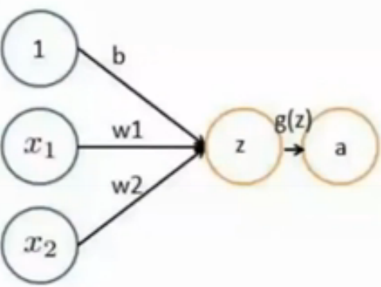

感知机
===
感知机是最简单的神经网络，它具备神经网络的必备因素

# 1.感知机模型

可以看出一个感知机有如下组成部分:
1. 输入权值:一个感知器可以接收多个输入$(x_1,x_2,...,x_n | x_i \in R)$,每个输入上有一个权值$\omega_i \in R$，此外还有一个偏置
项$b \in R$
2. 激活函数:感知器的激活函数可以有很多选择，比如我们可以选择下面这个阶跃函数来作为激活函数.一般为符号函数即
$$sign(x)=\begin{cases}
+1 & x \geq 0 \\\\
-1 & x < 0
\end{cases}$$
或者传递函数不一定非要是sign，也可以是Step阶梯函数等等，这个取决于输出空间Y的取值
$$step(x)=\begin{cases}
0 & x \leq 0 \\\\
1 & x > 0
\end{cases}$$
3. 输出:感知器的输出由下面这个公式来计算$y=f(\omega \bullet x + b)$

可以看出，感知机是一种线性分类器，属于判别模型。感知机模型的假设空间是定义在特征空间的所有线性分类模型活线性
分类器，即函数集合$\{f|f(x)=w \bullet x + b\}$

# 2.感知机学习模型
感知机的学习模型也是一种训练方法，其目的是修改神经网络的权值w和偏置b。根据上面的感知机模型，我们需要找到一系列的w以及偏置b，使得感知机能够很好的进行二分类

1. 初始化$w=\{w_1,w_2,...,w_n\}$以及偏置b
2. 计算实际结果$s = \sum_{i=1}^nw_ix_i+b$，然后带入某一类传递函数(符号函数或者阶梯函数)，得到实际结果$\alpha$
3. 计算误差$\epsilon=y-\alpha$
4. 如果$\epsilon=0$，则退出，否则往下
5. 计算$w_i^{new}=w_1^{old}+\epsilon \bullet x_i$
6. 计算$b^{new}=b^{old}+\epsilon$
7. 执行第2步直到收敛

Logistic回归映射到感知机上，如下图所示
