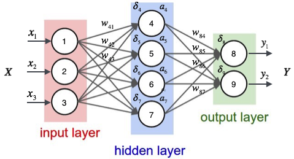

神经网络的初始化与反向传播算法
===
# 1.初始化
## 1.1.权重初始化
- 全零初始化:错误的初始化。因为如果全零初始化，那么所有的输出都是一样的，那么在反向传播中就会算出同样的梯
度，从而进行同样的参数更新，那么神经元之间也就失去了不对称性的源头.
- 小随机数初始化:权重要非常接近于0但是不能是0，解决办法就是生成小随机数，以此来打破对称性。方法就是
$\omega=0.01 * np.random.randn(D,H)$。$randn$函数是基于零均值和标准差的一个高斯分布来生成随机数，这样每
个神经元的权重向量都被初始化为一个随机向量，而这些随机向量又服从一个多变量高斯分布，这样在输入空间中，所
有的神经元的指向是随机的。但是这个方法有个问题，就是随着输入数据量的增长，随机初始化的神经元的输出数据的
分布中的方差也在增大。那么我们可以使用$\frac{1}{\sqrt{n}}$来校准方差，也就是$\omega=\frac{np.random.randn(n)}{\sqrt{n}}$，其中n是输入数据的数
量，这样就保证了网络中所有神经元起始时有近似同样的输出分布，这样可以提高收敛速度
- 对于ReLU神经元的特殊初始化:$\omega=\frac{np.random.randn(n)}{\sqrt{\frac{2}{n}}}$

## 1.2.稀疏初始化
另一个处理非标定方差的方法是将所有权重矩阵设为0，但是为了打破对称性，每个神经元都同下一层固定数目的神经元随
机连接(其权重数值由一个小的好似分布生成)。一个比较典型的连接数目是10个

## 1.3.偏置初始化
通常将偏置初始化为0.

## 1.4.批量归一化
其做法是让激活数据在训练开始前通过一个网络，网络处理数据使其服从标准高斯分布。在实现层面，应用这个技巧通常意
味着全连接层(或者卷积层)与激活函数之间添加一个BatchNorm层。

# 2.反向传播算法
神经网络是一个模型，权值就是模型的参数，也就是模型需要学习的东西。而神经网络的连结方式、网络的层次、每层的节
点数这些参数是人为事先设置的，这些参数叫做超参数。假设每个训练样本为$(\overrightarrow{x}, \overrightarrow{t})$，其中向量$\overrightarrow{x}$是训练样本的特征，而
$\overrightarrow{t}$是样本的目标值 

## 2.1.计算$y_i$
用样本的特征$\overrightarrow{x}$，计算出神经网络中每个隐藏层节点的输出$\alpha_i$，以及输出层每个节点的输出$y_i$

# 2.2.计算每个节点的误差项$\delta_i$
### 2.2.1.输出层节点
对于输出层节点i，有$\delta_i=y_i(1-y_i)(t_i-y_i)$，其中，$\delta_i$是节点i的误差项，$y_i$是节点的输出值，$t_i$是样本对应于节点i的目
标值。举个例子，根据上图，对于输出层节点8来说，它的输出值是$y_1$，而样本的目标值是$t_1$，带入上面的公式得到节点8的
误差项应该是$\delta_8=y_1(1-ky_1)(t_1-y_1)$

### 2.2.2.隐藏层节点
$$\delta_i=\alpha_i(1-\alpha_i)\sum_{k \in outputs}\omega_{ki}\delta_k$$
其中，$\alpha_i$是节点i的输出值，$\omega_{ki}$是节点i到它的下一层节点k的连接的权重，$\delta_k$是节点i的下一层节点k的误差项。例如，对于
隐藏层节点4来说，计算方法如下：$\delta_4=\alpha_4(1-\alpha_4)(\omega_{84}\delta_8+\omega_{94}\delta_9)$

### 2.2.3.更新每个连接上的权值
$$\omega_{ji} \leftarrow \omega_{ij} + \eta\delta_jx_{ji}$$
其中，$\omega_{ji}$是节点i到节点j的权重，$\eta$是一个成为学习速率的常数，$\delta_j$是节点j的误差项，$x_{ji}$是节点i传递给节点j的输入。例
如，权重$\omega_{84}$的更新方法如下
$$\omega_{84} \leftarrow \omega_{84} + \eta\delta_8\alpha_4$$
类似的，权重$\omega_{41}$的更新方法如下
$$\omega_{41} \leftarrow \omega_{41} + \eta\delta_4x_1$$
偏置项的输入值永远为1，例如节点4的偏置项$\omega_{4b}$应该按照下面的方法计算$\omega_{4b} \leftarrow \omega_{4b} + \eta\delta_4$。显然，计算一个节点的误差项，需要先计算每个与其相连的下一层节点的误差项。这就要求误差项的计算顺序必须是从输出层开始，然后反向依次计算每个隐藏层的误差项，直到与输入层相连的那个隐藏层。这就是反向传播算法的名字的含义。当所有节点的误差项计算完毕后就可以更新所有的权重

