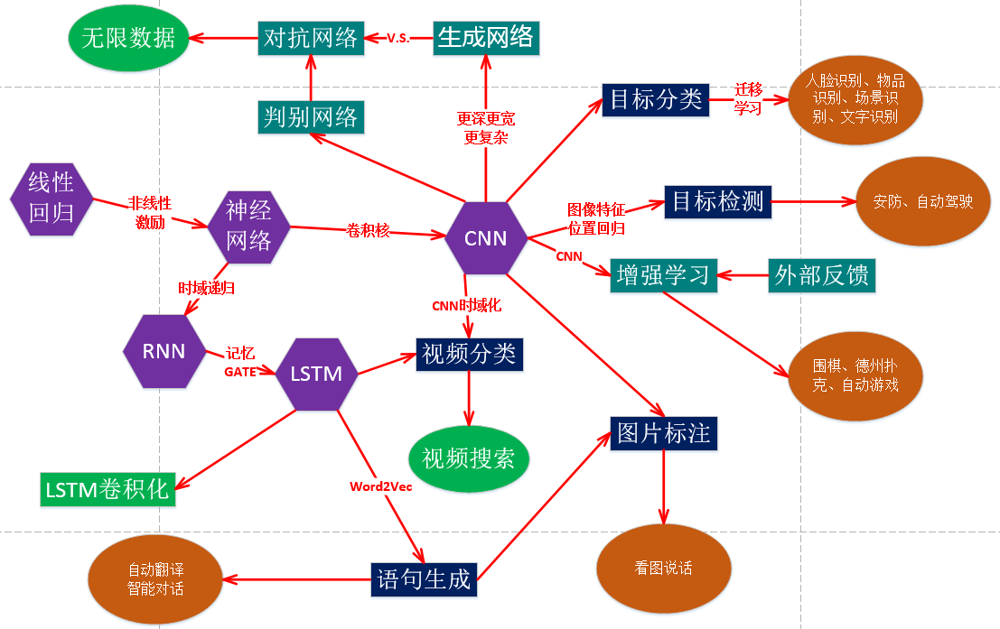
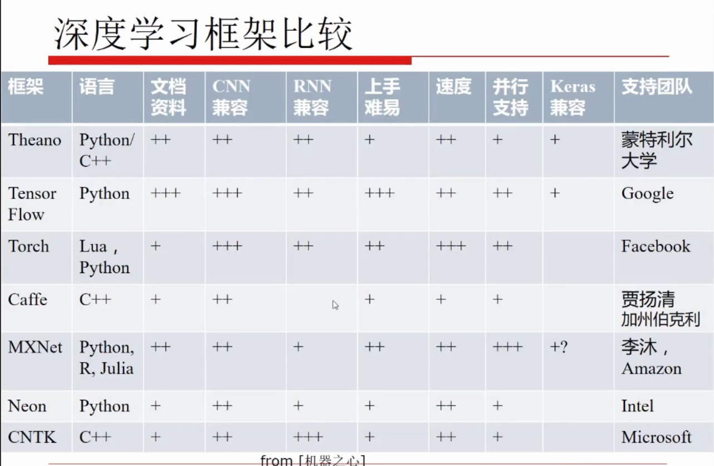
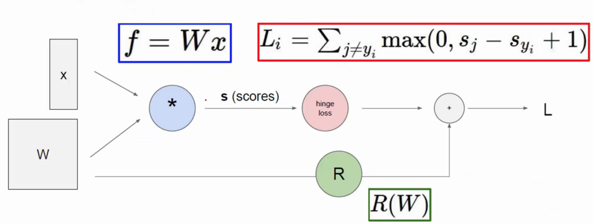
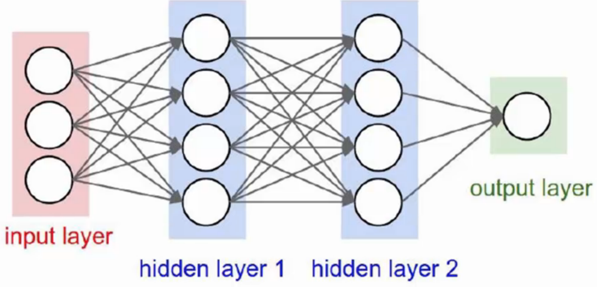

深度学习
===
# 1.概述与架构图

## 1.1 传统的机器学习与深度学习的区别
传统的机器学习流程是：
- 数据预处理:归一化、降维和去噪
- 特征提取:人为的找到一种模式，对数据进行一种提炼。图像：SIFT、LBP、Fisher、Gabor、Hog。语言：MFCC、小波、Word2Vec
- 选择分类器:包括SVM、决策树、随机森林、贝叶斯网络、线性回归或者聚类

深度学习的流程是：
- 数据准备
- 设计模型：CNN、RNN或CNN+RNN
- 训练：调结构、损失函数、训练参数

## 1.2 深度学习的应用
指挥交通、预测股票、诊断疾病、写小说、编笑话、打游戏、心理咨询、买菜砍价

# 2.基本概念与流程

其中x是输入，w是权重,我们的目的是要计算出来w，来最好的拟合x，使得损失函数最小。

计算损失函数的方向是前向传播.根据损失函数来更新w的过程，叫做反向传播。一旦损失函数不会在下降了，那么w就调整好了

一般分为三个过程：
- 前向传播：根据x，w计算出损失函数Loss
- 反向传播：根据Loss，计算出w，看看每个w对于最终的Loss产生多大的贡献
- 调整w，使得Loss最小

这就是神经网络基本的流程

神经网络的结构，其中圆圈代表神经元，粉色或蓝色的叫做层次。所以神经网络是由层堆叠而成，每个层都有若干神经元，层与层之间通过全连接进行连接。连接代表的是权重参数，中间的层叫做隐层。可以看出这里就相当于多个线性分类组合在一起。

隐藏层比较多（大于2）的神经网络叫做深度神经网络。而深度学习，就是使用深层架构（比如，深度神经网络）的机器学习方法。

那么深层网络和浅层网络相比有什么优势呢？简单来说深层网络能够表达力更强。事实上，一个仅有一个隐藏层的神经网络就能拟合任何一个函数，但是它需要很多很多的神经元。而深层网络用少得多的神经元就能拟合同样的函数。也就是为了拟合一个函数，要么使用一个浅而宽的网络，要么使用一个深而窄的网络。而后者往往更节约资源。

深层网络也有劣势，就是它不太容易训练。简单的说，你需要大量的数据，很多的技巧才能训练好一个深层网络

# 3.神经网络的种类
- 传统的神经网络：也就是全连接神经网络
- 卷积神经网络:CNN
- 深度神经网络:DNN
- 循环神经网络:RNN