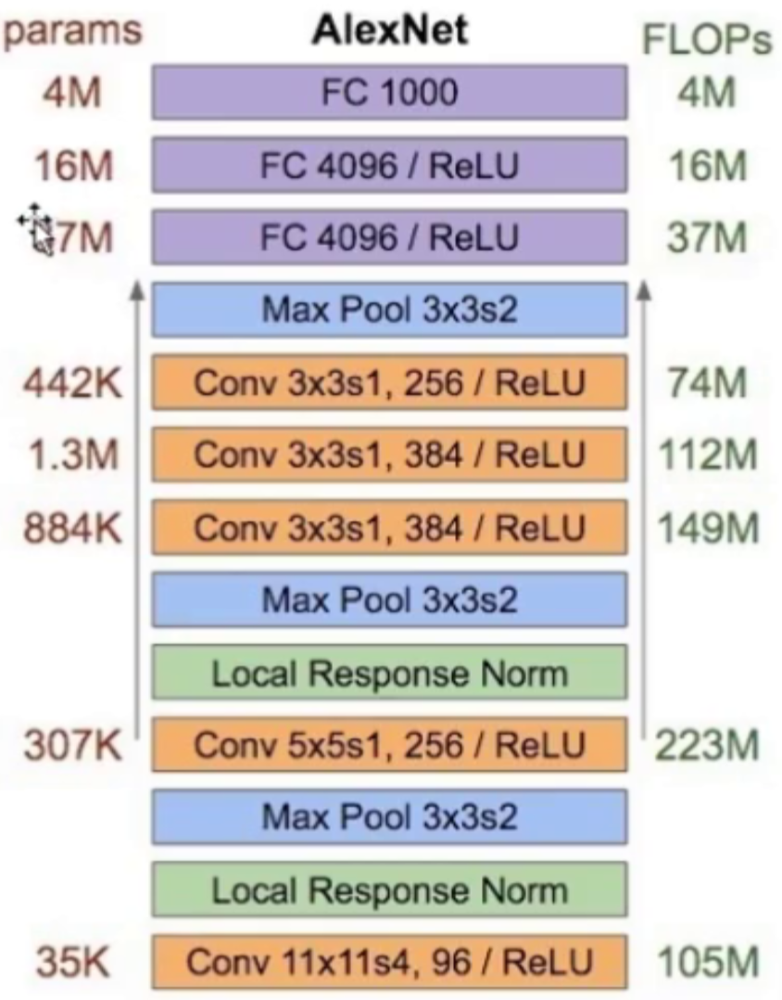
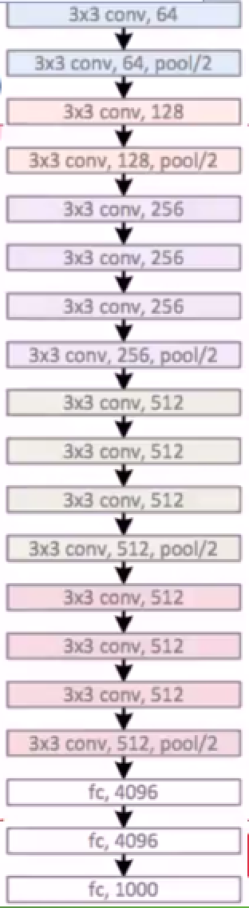

图像分类常用的卷积网络
===
网络复杂度有三个表征维度：深度、宽度、基数。VGG和残差网络最适合改进

# 1.AlexNet
8层,ImageNet-2012竞赛第一名，标志这DNN(深度神经网络)深度学习革命的开始，它使用了5个卷积层和3个全连接层的网络结构，包含60M个参数，以及650K个神经元，使用了两个GPU。特点是加入了局部响应归一化(Local Response Normalization$\Rightarrow$LRN)，模拟神经元的侧抑制机制. 红色的数字表示输出通道数(卷积核的个数，也就是输出的层数)，天蓝色表示卷积核的厚度
- 输入：$224\*224*3$
- 卷积层1：96$\*11\*11\*$3, $\rightarrow{LRN}\rightarrow{MP}\rightarrow{ReLU}$, LRN：局部响应归一化，MP：最大池化，每个显卡是$\frac{96}{2}=48$。采用96个$11\*11*3$的卷积核，在步长为4的情况下进行滤波，然后进行一次ReLU，一次Norm，一次Pooling，输出到下一层
- 卷积层2：256$\*5\*5*$48, $\rightarrow{LRN}\rightarrow{MP}\rightarrow{ReLU}$，(通道独立)
- 卷积层3：384$\*3\*3*$256, $\rightarrow{ReLU}$，(通道合并，双GPU交互)
- 卷积层4：384$\*3\*3*$192, $\rightarrow{MP}\rightarrow{ReLU}$，(通道独立)
- 卷积层5：256$\*3\*3*$192, $\rightarrow{ReLU}$，(通道独立)
- 全连接层1：$4096\rightarrow{ReLU}$
- 全连接层2：$4096\rightarrow{ReLU}$
- 全连接层3：$4096\rightarrow{ReLU}$
- Softmax层：$1000$
- Loss:标签概率的log值之和$argmax_{\omega}\{\frac{1}{N}\sum-log[p(f(w,\omega)=y(x))]\}$

# 2.VGG
19层(一般有16层和19层两种，19层使用的比较多)，结构简洁，容易修改，容易迁移到其它任务中去.高层任务的基础网络，ImageNet2014年竞赛第二名.它的重要思想就是大卷积核分解成连续多个小卷积核，这样有两个好处
- 核分解：$7*7\rightarrow$3个$3*3$核(核与核之间用ReLU连接)(被$7\*7$的卷积核卷积后，会丢失6个维度，被$3\*3$的卷积核卷积后，会丢失2个维度，所以说$7*7$的卷积核就等于3个$3\*3$的卷积核的级联  )
- 参数数量：$49C^2\rightarrow{27C^2}$，这样可以减少参数， ，增加深度

网络改造的首选基础网络，例如FCN，图片描述，图片问答等等，一样也是5个卷积层+3个全连接层，一样是两个GPU.

- VGG模型
- 输入层224*224*3

- 卷积层1：3*3，64，1 输出尺寸：224*224*64
- 卷积层2：3*3，64，1 输出尺寸：224*224*64
- 池化层1：2*2，maxpool，2 输出尺寸：112*112*64

- 卷积层3：3*3，128，1
- 卷积层4：3*3，128，1
- 池化层2：2*2，maxpool，2 输出尺寸：56*56*128

- 卷积层5：3*3，256，1
- 卷积层6：3*3，256，1
- 卷积层7：3*3，256，1
- 池化层3：2*2，maxpool，2 输出尺寸28*28*256

- 卷积层8：3*3，512，1
- 卷积层9：3*3，512，1
- 卷积层10：3*3，512，1
- 池化层4：2*2，maxpool，2 输出尺寸14*14*512

- 卷积层11：3*3，512，1
- 卷积层12：3*3，512，1
- 卷积层13：3*3，512，1
- 池化层5：2*2，maxpool，2 输出尺寸7*7*512 = 25088

- 非线性全连接层1：4096
- Dropout层1：训练时0.5，预测时1.0
- 非线性全连接层2：4096
- Dropout层2：训练时0.5，预测时1.0
- 线性全连接层1：1000
- softmax