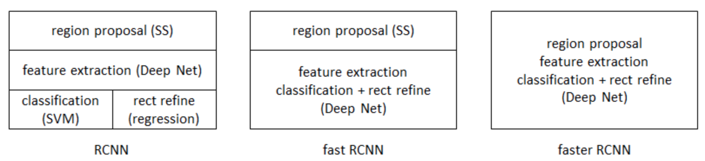

图像识别
===
# 1.图像识别概述
我们知道，在图像分类任务中，一般图片仅仅包含一个物体，我们的任务目标仅仅是根据图片得到图片中物体的类别；但是
对于图像识别任务来说，图片内部包含多个物体，我们的任务目标不仅需要对每个物品进行分类，而且还要标识出每个物品
的位置。下面就来介绍一下图像识别领域的各种经典算法

# 2.RCNN(Region-based Convolutional Neural Networks)
## 2.1.RCNN的基本过程
1. 先将region通过ss(Selective Search算法)检测出来(2k+)，然后根据cnn提取的region特征丢入svm进行分类(compute 
score)，得到的就是一个region-bbox以及对应的类别
2. 再利用(IoU->nms)得到具体的框，目的防止泛滥，为了精确bbox(nms:非极大值抑制算法).
3. 再根据pool5 feature做了个bbox regression来decrease location error- 其中training的trick则为hnm＋finetuning)

## 2.2.训练过程
### 2.2.1.预训练
首先需要训练一个完整的alexnet网络，用于生成后续网络的预训练模型

### 2.2.2.数据预处理
输入的数据都是带有bounding box(ground true)信息的图片，对于每张图片都需要做如下处理：
- 使用selectivesearch.selective_search生成若干的bounding box
- 通过算法合并和过滤一些bounding box
- 计算每个bounding box和ground true的IOU，如果大于阀值(一般为0.3)，那么这个bounding box对应的label就是这张图
片的label(正样本)；否则对应的label就是背景label(负样本)
- 这样一张图片就可以生成若干的记录，每个记录包括bounding box截取的图片信息、对应的label以及bounding box的坐
标信息
- 这些bounding box对应的图片信息，需要resize到224*224(alexnet的输入格式)
- 这样可以生成很多很多图片数据。每批数据应该包含128个实例，其中32个正样本，96个负样本

### 2.2.3.构建新网络
构建一个与之前的alexnet一模一样的网络，只不过需要输出的4096维的特征向量，而不是之前的具体分类个数的特征向
量，然后加载之前训练好的模型参数。然后将数据预处理中的图片信息输入到这个网络进行预测，可以得到若干的特征向
量，每个特征向量是4096维的。将这些特征向量与对应的label输入到SVM.LinearSVC模型进行训练

### 2.2.4.预测
将需要预测的图片通过selectivesearch.selective_search生成若干的bounding box,然后放入2.3中的新网络生成若干的4096
维特征向量，然后将这些特征向量放入已经已经训练好的SVM模型中进行预测，如果结果是背景，那么舍弃，否则这个
bounding box就需要画出来。

### 2.2.5.ounding-box Regression边框回归
具体可以参考[Link](http://m.blog.csdn.net/zijin0802034/article/details/77685438),但是没有具体的代码实现

### 2.2.6.总结
 

# 3.简化网络的Fast-RCNN
## 3.1.RCNN的缺陷
- RCNN一张图像内候选框之间大量重叠，提取特征操作冗余
- 由于提取特征操作冗余，所以训练时速度很慢
- RCNN中独立的分类器和回归器需要大量特征作为训练样本，所以训练时所需空间较大

## 3.2.Fast RCNN的改进
针对RCNN的问题，Fast RCNN从以下三个方面进行了改进：

### 3.2.1.测试时速度慢 
RCNN一张图像内候选框之间大量重叠，提取特征操作冗余。本文将整张图像归一化后直接送入深度网络。在邻接时，才加
入候选框信息，在末尾的少数几层处理每个候选框。

### 3.2.2.训练时速度慢 
原因同上。在训练时，本文先将一张图像送入网络，紧接着送入从这幅图像上提取出的候选区域。这些候选区域的前几层特
征不需要再重复计算。

### 3.2.3.训练所需空间大 
RCNN中独立的分类器和回归器需要大量特征作为训练样本。把类别判断和位置精调统一用深度网络实现，不再需要额外存
储。

## 3.3.总结
RCNN主要是使用Selective Search算法计算出Proposal，然后送入SVM进行分类训练，然后送入一个CNN的回归网络进行
bounding box的训练。而Fast RCNN仍然需要使用Selective Search算法计算出Proposal，只是它将后续的分类训练和回归训
练合并到了一个CNN网络中，不在需要进行两步操作(ROI层) 
 

# 4.Faster RCNN
Faster RCNN在Fast RCNN的基础上，将proposal的选取工作也放到了网络中，这样通过一个CNN网络，就可以同时生成
Proposal(RPN层)，而且也可以同时进行分类和回归的训练 

## 4.1.总体架构

 
## 4.2.核心网络架构

## 4.3.一些解释
### 4.3.1.关于Conv Feature Map
对于获取Conv Feature Map的CNN网络，我们一般使用ZF5层网络或VGG16的13层网络这两种形式；如果是ZF5层网络，它
的输出是$N\*N*256$；如果是VGG16的话它的输出就是$N\*N\*512$

### 4.3.2.关于gt_boxes
gt_boxes就是Group Truth Boxes，它是训练集中的true proposals的信息，一般放在annoations下面

## 4.3.3.关于整体流程
整个Faster RCNN相当于是RPN网络+Fast RCNN的集合，首先它需要训练RPN网络，然后根据训练好的RPN网络，得出
proposals，然后与原始图片一同传入RoI Pooling层得到最终统一的rois，然后传入全连接层进行训练。

## 4.3.4.关于Anchor boxes
我们可以看到过了CNN之后，会输出一个N\*N\*256的feature map，相当于这是一张N\*N的图，且有256通道。然后经过一个3\*3卷积和两个1\*1的卷积之后开始分叉，一个输出N*N*18，一个输出N*N*36。这是因为我们在每个点上增加了9个anchor box。
# 5.YoLoV1

# 6.YoLoV2

# 7.SSD