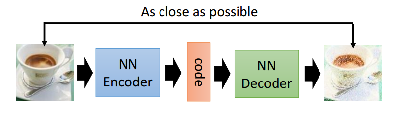

自编码器
===
# 1.传统机器学习的瓶颈
传统的机器学习任务很大程度上依赖于好的特征工程，但是特征工程往往是非常耗时耗力的，在图像、语音、视频中提取有
效的特征就更难了。更关键的是，工程师必须在某种数据处理专业领域有很深的造诣，比如CV工程师，NLP工程师，语音处
理工程师，量化交易工程师

# 2.无监督特征学习的特点
- 无监督学习：即我们不需要标注数据就可以对数据进行一定程度的学习，这种学习是对数据内容的组织形式的学习，提
取的是频繁出现的特征
- 逐层抽象：特征是需要不断抽象的，就像人总是从简单基础的概念开始学习，在到复杂的概念

# 3.特征的粒度与稀疏编码
像素级别的特征没有任何意义，为了让机器可以从像素中提取出有效的特征，可以使用稀疏编码

## 3.1.稀疏编码
- 选择一组S[k]，然后调整a[k]，使得$\sum_k(a[k] * S[k])$最接近与T
- 固定住a[k]，在400个碎片中，选择其它更适合的碎片S'[k]，替换原先的S[k]，使得$\sum_k(a[k] * S'[k])$最接近T

经过几次迭代后，发现最佳的S[k]组合，基本是照片上不同物体的边缘线，这些线段形状相似，区别在于方向。这就说明，
复杂图形，往往是有一些基本结构组成的，可以按照线段的不同权重调和而成。同样声音也是这样的。

## 3.2.Xaiver Initialization初始化
如果深度学习模型的权重初始化的太小，那信号将在每层间传递时逐渐缩小而难以产生作用，如果权重初始的太大，那信号
将在每层间传递时逐渐放大并导致发散和失效，如果有了Xaiver初始化，它就是让权重满足0均值，同时方差为$\frac{1}{n_{in}+n_{out}}$，分
布可以用均匀分布或高斯分布

# 4.AutoEncoder自动编码器
## 4.1.介绍
Deep Learning最简单一种方法就是利用人工神经网络的特点。人工神经网络ANN本身就是具有层次结构的系统，如果给定
一个神经网络，我们假设输出与输入是相同的，然后训练调整其参数，得到每一层中的权重，自然的我们就得到了输入I的集
中不同表示，其中没一层代表一种表示，这些表示就是特征，自动编码起就是一种尽可能浮现输入信号的神经网络。为了实
现这种复现，自动编码起就必须捕捉可以代表输入数据的最重要的因素，就像PCA那样，找到可以代表原信息的主要成分。

- 输入一批无标签的数据，然后进行编码，紧接着进行解码，可以得到一批计算后的数据，然后跟原始数据进行比较，可
以得到误差。我们需要做的就是调整编码和解码的参数，使得重构误差最小，这样就得到了特征
- 训练好一层之后，需要进行下一层的输入，同样假如一个编码器和一个解码器，然后固定第一层的编码器，同时去掉第
一层的解码器，继续训练...同样的办法可以训练多层
- 这样就训练好了多层，最后我们需要假如一个分类器，比如SVM或者Logistic回归等，然后通过标准的多层神经网络的
监督训练方法(梯度下降法)去训练
- 从输入到隐藏层，这一段神经元数量下降，被称为”encoder”，也可以称为模式识别模型或判别模型；而从隐藏层到输
出，这一段神经元数量上升，被称为”decoder”，也称生成模型。因而编码器在一定程度上是类似于GAN
- 自编码器尝试使用一个函数，将输入逼近输出，经过训练之后，撤去输入层，仅凭隐藏层也可以实现重现输出
- 这样隐藏层就需要做到提取主要成分的任务。这样的功能实现了隐藏层对于数据特征的提取，类似于主成分分析

## 4.2.自编码器的一般结构
 
从上面的图中，我们能够看到两个部分，第一个部分是编码器(Encoder)，第二个部分是解码器(Decoder)，编码器和解码器
都可以是任意的模型，通常我们使用神经网络模型作为编码器和解码器。输入的数据经过神经网络降维到一个编码(code)，
接着又通过另外一个神经网络去解码得到一个与输入原数据一模一样的生成数据，然后通过去比较这两个数据，最小化他们
之间的差异来训练这个网络中编码器和解码器的参数。当这个过程训练完之后，我们可以拿出这个解码器，随机传入一个编
码(code)，希望通过解码器能够生成一个和原数据差不多的数据，上面这种图这个例子就是希望能够生成一张差不多的图
片。

## 4.3.常见自编码器
常见自编码器包括标准自编码器，变分自编码器，降噪自编码器和稀疏自编码器

### 4.3.1.标准自编码器
标准自编码器的结构就是自编码器的一般结构，它使用多层感知机或者神经网络来充当编码器和解码器，神经网络的效果会好一些

## 4.1.Sparse AutoEncoder稀疏自动编码器
在AutoEncoder的基础上记上L1正则化的限制(L1约束每一层节点中大部分都要为0，只有少数不为0，这也就是稀疏的名字来
源)

## 4.2.Denoising AutoEncoders降噪自动编码器
降噪自动编码器实在自动编码器的基础上，训练数据假如噪声，所以自动编码器必须学习去除这种噪声而获得真正的没有被
噪声污染过的输入，因此他的繁华能力比一般编码器强，它可以通过梯度下降法来训练

## 4.3.Variational Autoencoder变分自编码器

## 4.4.Adversarial Autoencoder对抗自编码器
