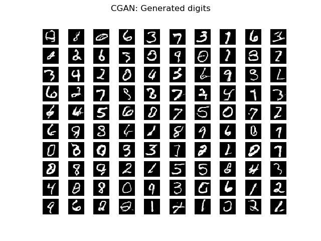
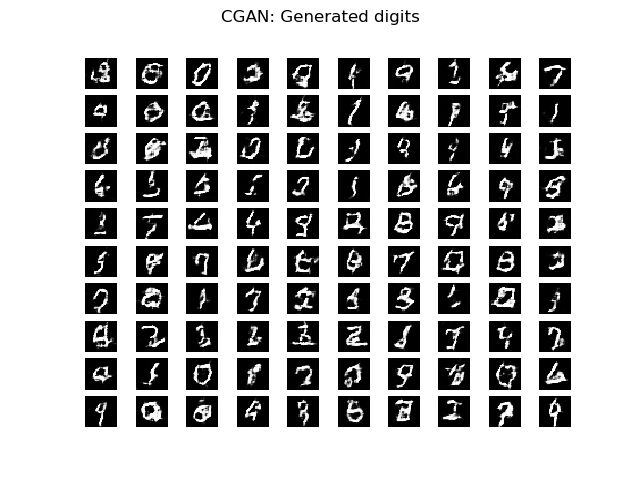
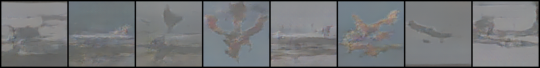
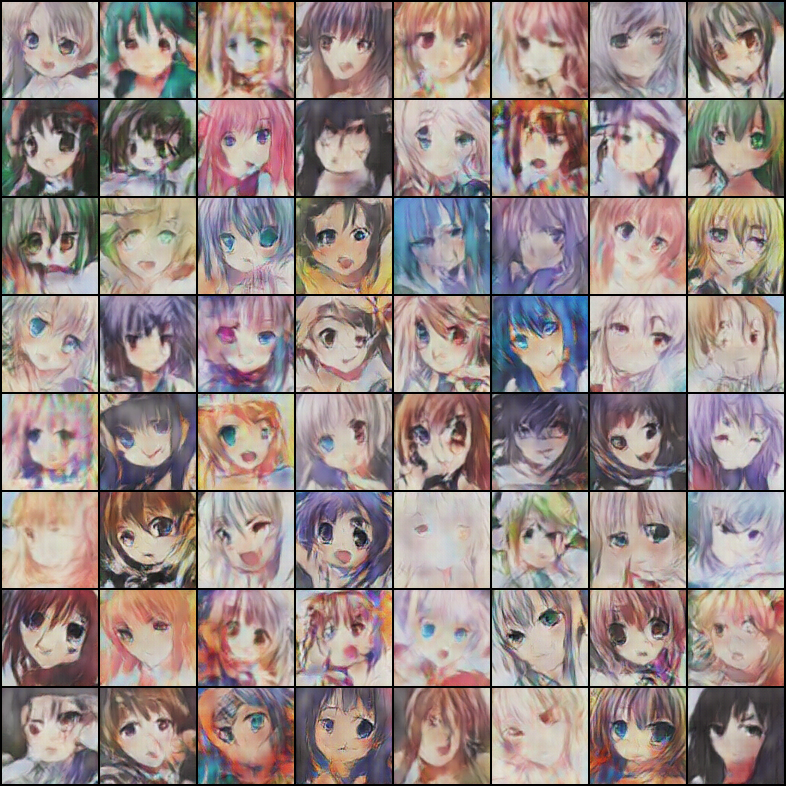
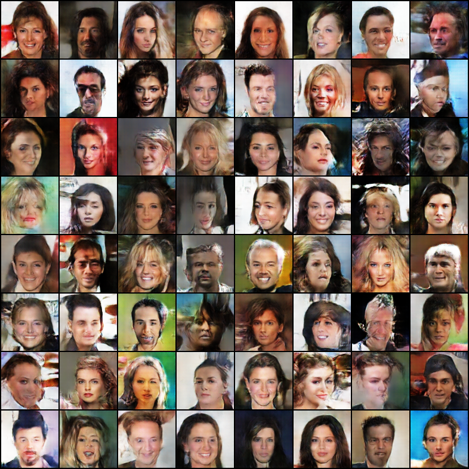

深度卷积生成对抗网络-Deep Convolution Generative Adversarial Nets
===
本节的例子包括生成MNIST手写数字、生成STL数据集中的飞机图像、生成动漫头像以及生成名人人脸头像
# 1.生成MNIST手写数字
运行30个Epoch之后的图像如下 

生成动画如下 

生成模型h5文件文件为Keras_Mnist_Generator_dcGAN.h5,在[百度云盘](https://pan.baidu.com/s/1JWLMbibaH1yGZKcIvyT4hQ#list/path=%2F%E6%A8%A1%E5%9E%8B)

# 2.生成STL数据集的飞机图像-pytorch和keras实现
## 2.1.pytorch版本
由于STL飞机分类的训练数据只有500张，所以我提前将飞机分类的训练数据集和测试数据集共1300张图片都放在了一起，
然后进行训练，但是1300张图像还是数据量少，所以训练了1000个epoch，训练完1000个epoch之后的图像如下 
 
生成动画如下 
 
生成模型pth文件文件为dcGAN_STL_airplane_generator.pth,在[百度云盘](https://pan.baidu.com/s/1JWLMbibaH1yGZKcIvyT4hQ#list/path=%2F%E6%A8%A1%E5%9E%8B)

## 2.2.Keras版本

# 3.生成动漫头像-Pytorch实现
运行190个Epoch之后的图像如下 
 
生成动画如下 
 
**代码主要参考了[link](https://github.com/chenyuntc/pytorch-book/tree/master/chapter7-GAN%E7%94%9F%E6%88%90%E5%8A%A8%E6%BC%AB%E5%A4%B4%E5%83%8F)** 
生成模型pth文件文件为dcGAN_faces_generator.pth,在[百度云盘](https://pan.baidu.com/s/1JWLMbibaH1yGZKcIvyT4hQ#list/path=%2F%E6%A8%A1%E5%9E%8B)

# 4.生成名人人脸
运行50个Epoch之后的图像如下 

生成动画如下 

生成模型pth文件文件为Faces_Generator.pth,在[百度云盘](https://pan.baidu.com/s/1JWLMbibaH1yGZKcIvyT4hQ#list/path=%2F%E6%A8%A1%E5%9E%8B)

