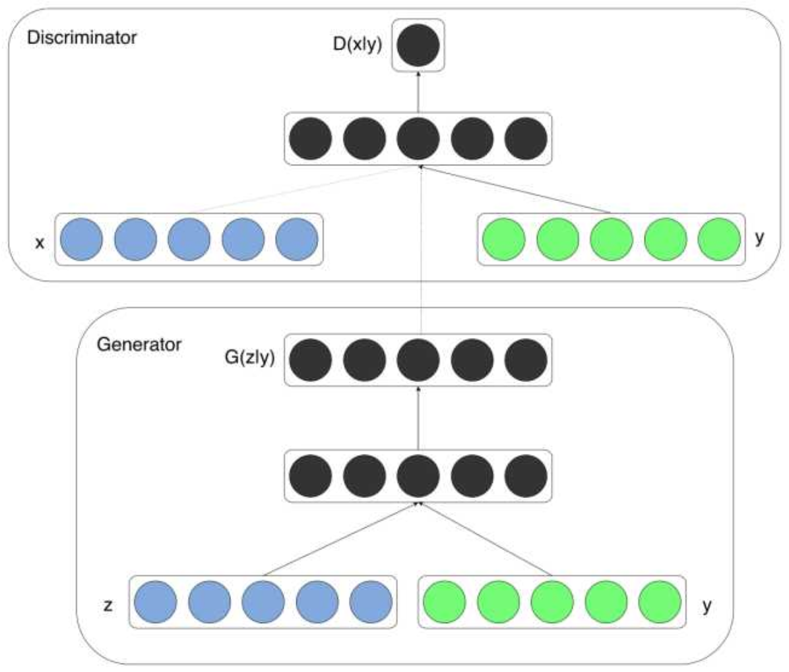

cGAN(Conditional Generative Adversarial Nets)
===
GAN中输入是随机的数据，没有太多意义，那么我们很自然的会想到能否用输入改成一个有意义的数据，最简单的就是数字
字体生成，能否输入一个数字，然后输出对应的字体。这就是CGAN要做的事，就是在G网络的输入在z的基础上连接一个输
入y，然后在D网络的输入在x的基础上也连接一个y。

，那么目标函数就变成了$min_{G}max_{D}V(D,G)=E_{x\sim p_{data}(x)}[logD(x|y)]+E_{z\sim p_z(z)}[log(1-D(G(z|y)))]$。训练方式
几乎就是不变的，但是从GAN的无监督变成了有监督

CGAN是GAN的条件变体，其中生成器被指示生成具有特定特征的真实样本，而不是来自完全分布的通用样本