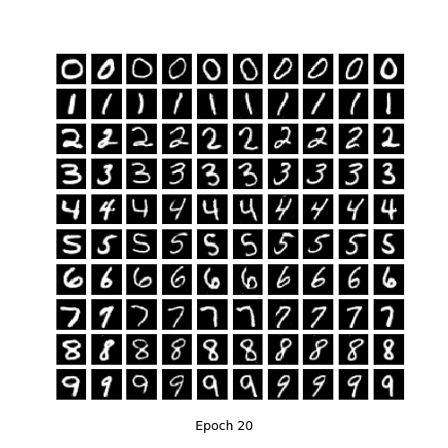
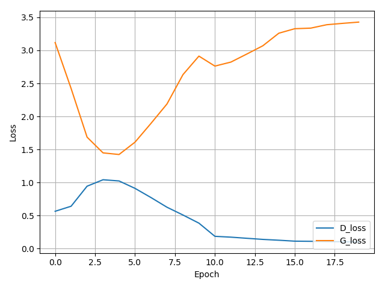
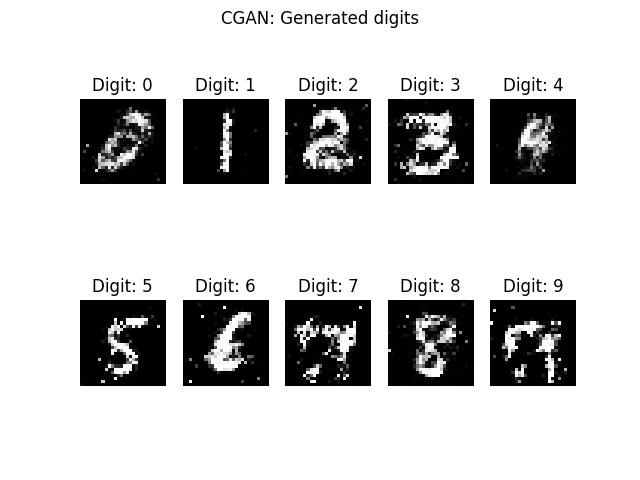
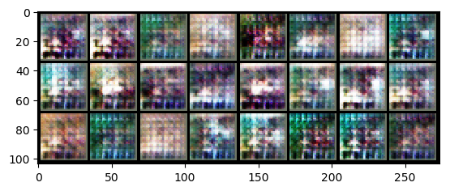
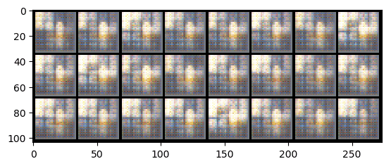

条件生成对抗网络-cGAN(Conditional Generative Adversarial Nets)
===
# 1.MNIST数据集
在生成器和判别器中都加入label的信息，pytorch框架训练20个epoch之后的结果如下图 
 
 
Loss的变化如下图所示: 

生成模型pth文件为pytorch_mnist_generator_cdan.pth,在[百度云盘](https://pan.baidu.com/s/1JWLMbibaH1yGZKcIvyT4hQ#list/path=%2F%E6%A8%A1%E5%9E%8B)

Keras版本的结果如下 
 
 
生成模型h5文件为keras_mnist_generator_cdan.h5,在[百度云盘](https://pan.baidu.com/s/1JWLMbibaH1yGZKcIvyT4hQ#list/path=%2F%E6%A8%A1%E5%9E%8B)

# 2.Cifar10数据集
 
 
生成模型pth文件为pytorch_cifar10_cdan_G_19.pth,在[百度云盘](https://pan.baidu.com/s/1JWLMbibaH1yGZKcIvyT4hQ#list/path=%2F%E6%A8%A1%E5%9E%8B)

# 3.名人人脸数据集
根据性别来做一个条件生成网络。我们需要首先将数据集的属性txt文件转化成csv文件，这样我们比较好处理

## 3.1.属性文件转化
将[属性文件](../common/face_attr.txt)放在ganData目录下，然后运行[TransTXTtoCSV](../common/TransTXTtoCSV.py)，可以生成[属性CSV文件](../common/face_attr.csv)

## 3.2.生成数据集
基于../ganData/face的全数据集，可以运行[Code](../common/BuildFaceGenderDataSet.py)来根据性别对图片数据进行分类，生成face_gender数据集

## 3.3.运行代码
